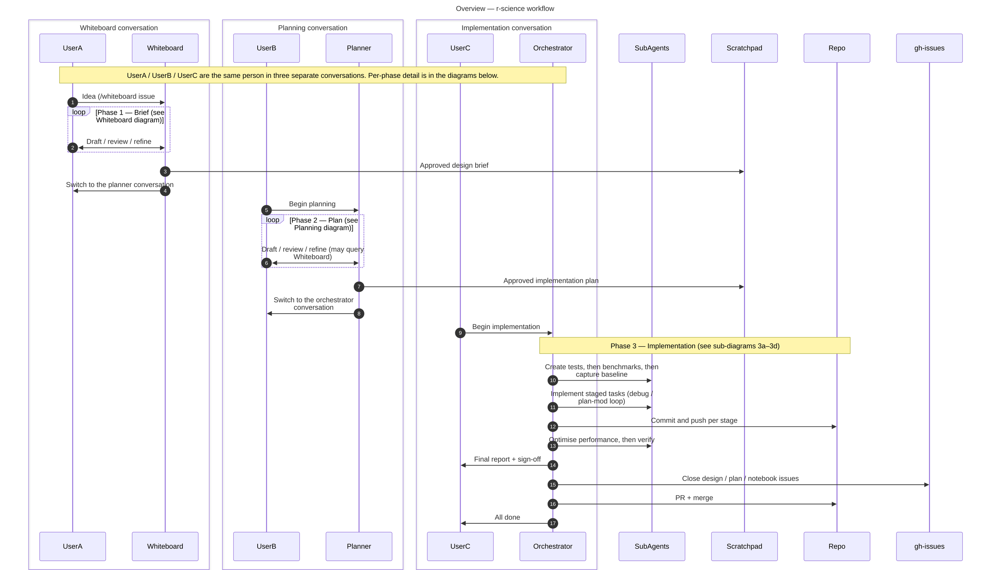
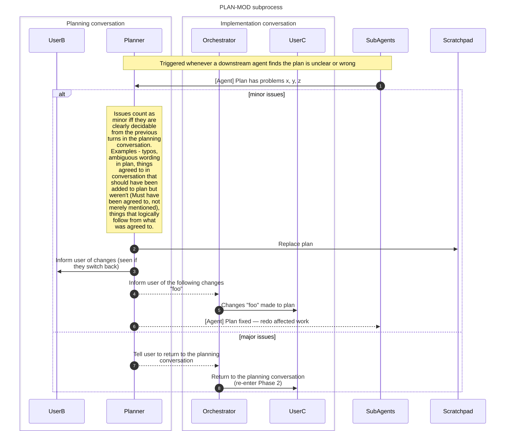
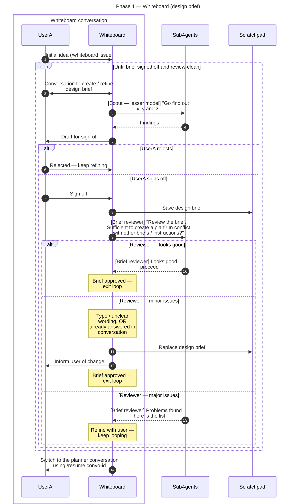
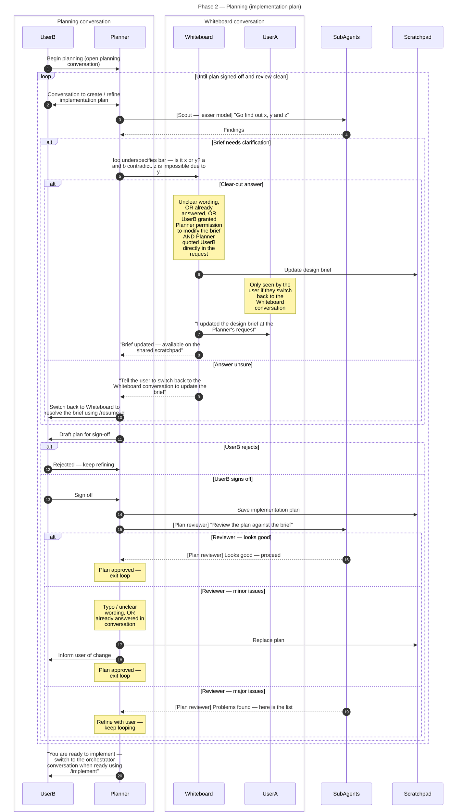
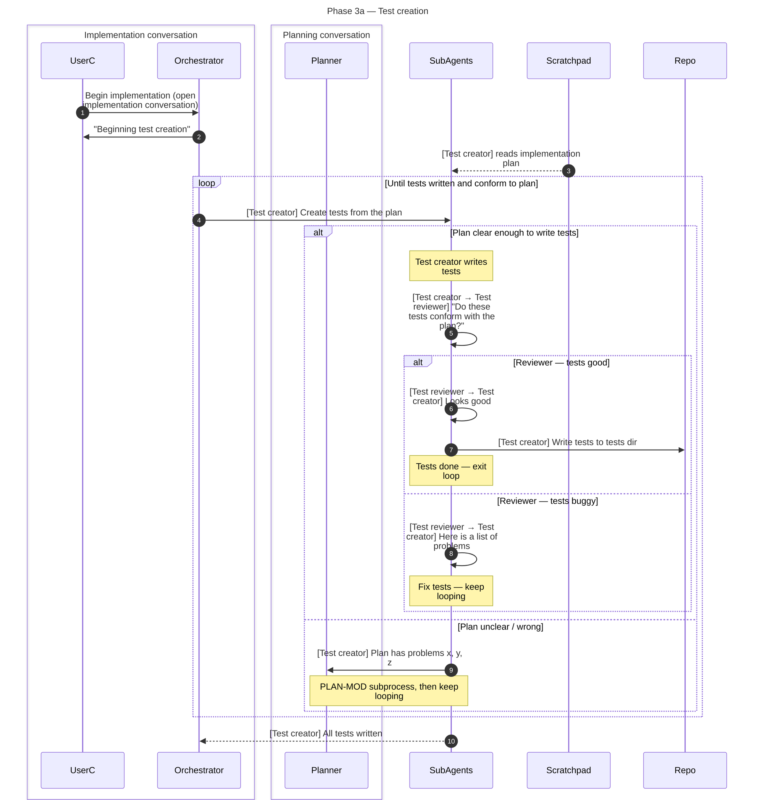
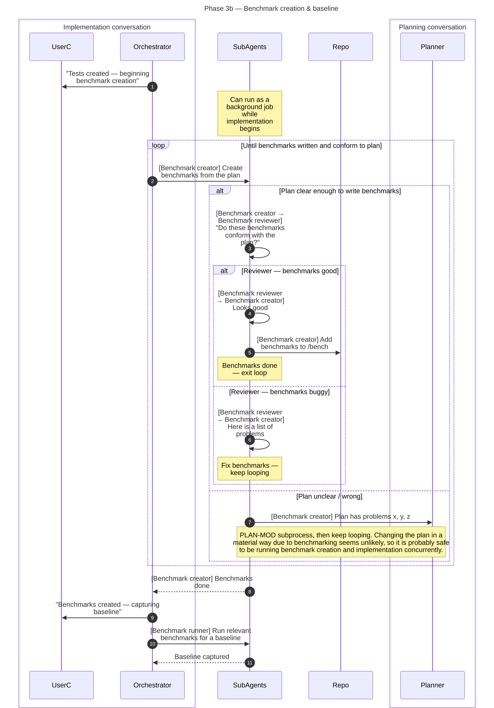
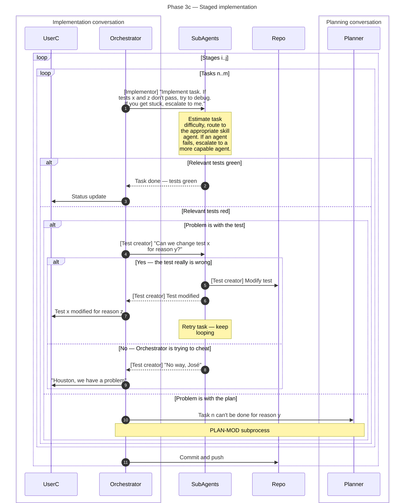
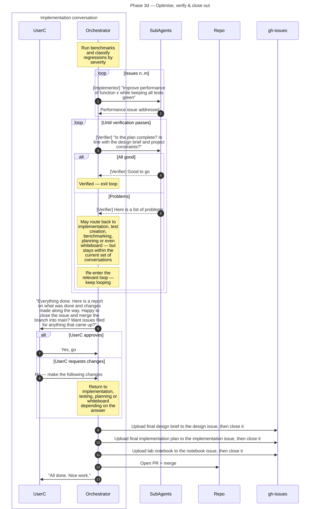

# workflow

This workflow is aimed to replace the r-science workflow. It is generalisable and will have multiple differing manifestations. R-Science will be one manifestation (with particular tools and desiderta) but the high level design shouldn't be tied to R-Science in particular. It may also be for creating quite different things like a complex management plan (in which case the idea of testing and benchmarking changes, but the general concept I think, stays the same).

The workflow spans three separate conversations (context windows) that share a scratchpad, the repo, and the GitHub issues. **UserA, UserB and UserC are the same person** — shown separately to emphasise that each conversation only sees the text written into it. The source of truth within a conversation, is the conversation itself. The source of truth between conversations during the same session is the scratchpad (Claude Code has some built in system for this? How does it work? Are there any important details?) Github issues is the source of truth between sessions. They are structured summaries of what was previously done - the state of thinking BEFORE the current session.

This document splits the workflow into an **overview** plus one diagram per phase, so each fits on a screen and can grow independently. The implementation phase is split further into its own sub-steps.

The workflow models a very un-agile system. I would like to modify it to make it more agile.

## Thoughts:

### Make stages/components/tasks first class citizens.

There is a fractal nature to what we were discussing in issue #16. We had a workflow where the package starts as idea (issue #1) which then spawns issues #2-n which each then spawn sub-issues #n-m which then each spawn a plan with stages 1-n which each then have task 1-n. The general process potentially works at each level (though by the time you get to individual tasks, you probably don't want to be whiteboarding them - Though sometime you might want to...). How they differ is by how certain that they are the correct thing to do (is that actually the correct description of the axis?). When we aren't sure what we are meant to be doing we need to whiteboard it until we have something that hangs together.

Let's refer to this fractal general class of semi-heirarchical things as components

### Stability

pre-alpha: a vague idea
alpha: API, but no load bearing internal content
beta: API, plus mocked up/approximate internal content
v1: API, MVP correct internal content - tested and optimised
v2..n: API, Expanded correct internal content - tested and optimised

Each component gets given a version number. This is independent of the version of the finished artefact as a whole. 

### Cost/reliability ladder

Creating a v1 (let alone vN) component is costly. However, once you have made it you are fairly certain that it is (locally) the correct thing (it does what it says on the box). However, without having built all the other things, you can't know if it is also globally the correct thing (did we actually want that sort of thing?)

Cost curve: From cheapest, but least reliable to most expensive but most reliable we have:
- Reasoning (thought experiments)
- Research (other people's existing experiments - different to your situation, but useful)
- prototypes
- actual implementation

Note: this is approximate and 

So the way to test our top level idea is to build the whole thing. But we don't want to build the whole thing and then realise that we built the wrong thing. Instead we want to find out we are doing something wrong as early as possible (fail early, fail often). So getting one component to v1 (or worse vN) before starting on the next one is the wrong approach.

# Idea 1
- pad out along the cost curve at the same rate across the entire project

# Idea 2
- Assign confidence and centrality to differnt components and really work thru those before working thru others. 
    - If an edge bit is wrong we can probably re-design it without redesigning the whole project. If a central bit is wrong, we need to re-design everything.
    - We probably don't need to worry too much about investigating the assumption that the earth goes around the sun. We DO need to spend time figuring out if our non-standard statistical technique actually works with our data.
    - The confidence and centrality are two seperate issues, but they interact.

### Divergent/Convergent thinking

At first I thought that the distinction between whiteboarding and planning was divergent vs convergent thinking. But I'm not sure that is true (maybe it is). It feels like it might be an issue of specificity instead. I'm not really sure.

Anyway, there are algorthms for choosing the ideal mixture of exploration vs exploitation. We should think how this could link in.

If a single leaf has an issue, that doesn't mean the central thesis is wrong, but if multiple different leaves all are having the similar issues, then it is time to rethink the central thesis. 

### Synthesis

We at least need to have a path from whiteboard that isn't "plan -> implement -> test -> optimiste -> validate". It is more like "Create components at pre-alpha or alpha stage, which will themselves be whiteboarded". Similarly, plan should be able to say: something like "Here are the stages:

1. Routine - we know we can make it work. We know how it will work with other components. Just leave at pre-alpha (what the plan produces)
2. Hard, but doable - let's make a beta version now so we can see how it hangs together with the rest. 
3. Routine - pre-alpha
4. Under-specified and big - this needs to be sent to its own whiteboard/planning process to break into sub-components
...
n. laod-bearing - we really need to know that this piece works and works properly. Let's build it to v1 now."

In fact maybe that is the difference between plan and whiteboard, plan creates and ranks components and then sends them to different plances (whiteboarding, implementation, etc)? I don't know. I'm not convinced that whiteboard and plan are actually the correct ideas.

---

## Overview

---

## PLAN-MOD subprocess

Referenced by the implementation diagrams (3a–3c) whenever a downstream agent finds the plan is unclear or wrong.

---

## Phase 1 — Whiteboard (design brief)

---

## Phase 2 — Planning (implementation plan)

---

## Phase 3a — Test creation

---

## Phase 3b — Benchmark creation & baseline

---

## Phase 3c — Staged implementation

---

## Phase 3d — Optimise, verify & close out

