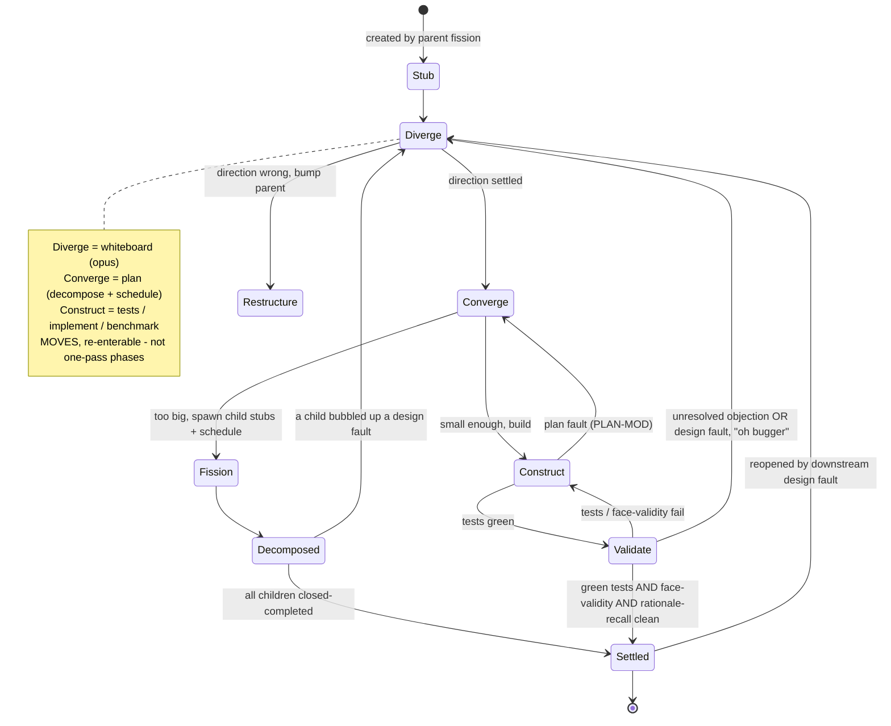
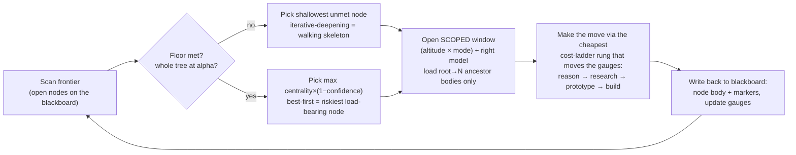
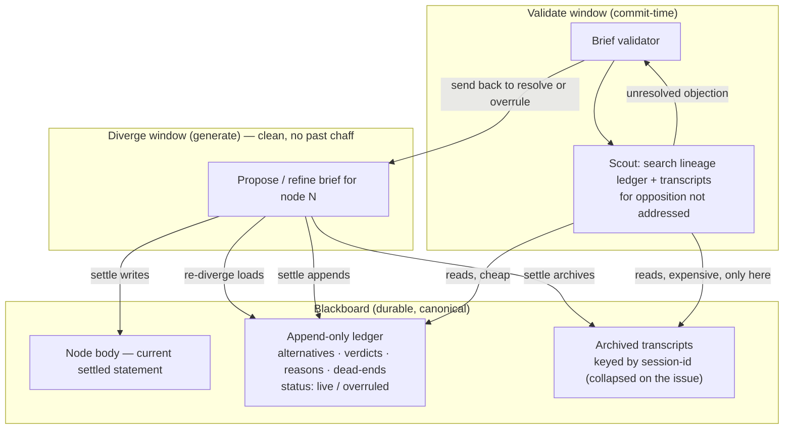
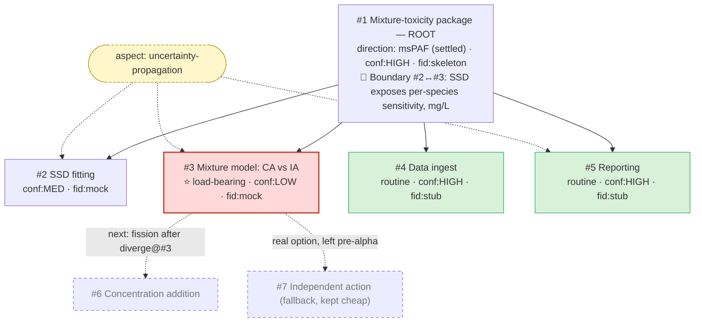

# Workflow redesign (draft) — the design tree as a research programme

> **Status:** initial draft, 2026-06-14. Builds on the whiteboard conversation
> that produced the diagrams below. Supersedes the *framing* in
> `updated_design.md` (kept for history) — that document drew an agile thesis on
> top of a waterfall skeleton; this one removes the skeleton. Not yet reconciled
> in detail with every child of #16 (see §9, §11).

---

## 1. The reframe, in one paragraph

Stop modelling the workflow as a **pipeline** (`whiteboard → plan → implement`
walked once) and model it as a **scheduler walking a tree of hypotheses**.
"Whiteboard" and "plan" become **moves you can make on any node**, not global
stages. **Maturity means "risk retired," not "release version."** The separate
context windows you want are preserved — but they're keyed by **altitude × mode**
and re-entered on demand, not three singletons traversed left-to-right. The old
three-conversation pipeline is exactly the **depth-1 special case** of this: a
project that never fissions *looks* like whiteboard → plan → implement.

## 2. Why the previous designs felt wrong

- **Genre fought thesis.** A sequence diagram can only express a timeline; the
  swimlanes *are* the waterfall. Agile thoughts bolted into the prose couldn't
  survive the diagram underneath.
- **Four axes were compressed into one "version" number.** "pre-alpha → v1"
  silently mixed *fidelity of the artefact* with *confidence in the decision*.
  They're orthogonal (a settled design can be a stub; a built v1 can be of
  doubtful design).
- **Release-tier semantics don't fit design nodes.** "alpha = API, no internal
  content" is meaningless for a high-altitude design decision.

## 3. Core concepts

### 3.1 The node — a first-class fractal component

One recursive type at every altitude. The old artefacts — *design brief*,
*plan*, *stage*, *task* — collapse into **a node at a given altitude and
maturity**. A node is a **GitHub issue** carrying:

- the **markers** already specified in #18 (`Part-of`, `aspect`, `Boundary`,
  `Blocked-by`, `Design`, `Eq`, `Cites`, `Dead-end`);
- two **gauges** (§3.2): *confidence* and *fidelity*;
- a **body** = the current settled statement;
- an **append-only decision log** (the issue comments) = rationale & history,
  including rejected alternatives (§7).

### 3.2 The four axes

| Axis | Question it answers | Range | Source |
|------|--------------------|-------|--------|
| **Altitude** | Where in the tree? | root → leaf | tree depth (structural) |
| **Fidelity** | How *real* is the artefact? | stub → mock → real → tuned | set by the *construct* move; arguably leaf-only |
| **Confidence** | How sure are we this is *right*? | idea → tentative → settled | set by *diverge*/*validate* (+ user) |
| **Centrality** | How much rests on it? | belt → core | **derivable** from the graph (closeness to root + `Boundary`/`Blocked-by` in-degree) |

Altitude and centrality are (largely) computable from the issue graph the #24
extractor already builds. Fidelity and confidence are set by the moves.

### 3.3 Maturity = risk retired

Read maturity as **how much risk has been retired** (Boehm's spiral model), not
as a release tier. This is what makes "advance the riskiest load-bearing node
first" the natural policy (§5).

### 3.4 The blackboard substrate (= #24)

Agents never talk directly. They read/write a **shared structure** — the issues
+ markers — and a **controller** (the scheduler) decides who acts next. This is
the classic *blackboard architecture*, and **#24's markers + extractor + linter
+ context-MCP are exactly that substrate.** Nothing about #24 is wasted by this
redesign; it is the load-bearing floor.

- **Body = current truth.** **Comments = append-only rationale log.** (#17
  already states this: *"full reasoning is in this issue's comments… the body is
  the current settled statement."*)

## 4. The moves (replacing the phases)

The existing skills don't disappear — they become **moves invoked per node**:

| Move | Old skill | What it does | Window / model |
|------|-----------|--------------|----------------|
| **Diverge** | `whiteboard` | "Is this the right thing?" + scout | new scoped window, opus |
| **Converge** | `plan` | Make concrete; **decompose + schedule** children (assign each a target maturity + a method) | scoped window |
| **Construct** | `tests` / `implement` / `benchmark` | Build a leaf to its target fidelity | leaf window + subagents |
| **Validate** | `verify` / `review` / brief & plan validators | Tests green **and** face-validity; **+ rationale recall** (§7) | scoped window |
| **Restructure** | (new, was implicit) | Move a boundary / re-parent — a structural change owned by the parent | parent window |



## 5. The scheduler (the engine the old diagrams lacked)

A **cycle**, not a line. Two-tier policy:

1. **Floor first — walking skeleton.** Iterative-deepening: get the *whole* tree
   to `alpha` (APIs wired, internals mocked, end-to-end runnable) before
   deepening anything. You always have a coherent, runnable whole (an *anytime*
   algorithm).
2. **Best-first above the floor.** Advance the node maximising
   **centrality × (1 − confidence)** — the load-bearing thing you're least sure
   of — using the **cheapest rung of the cost ladder** that can move its gauges
   (*reason → research → prototype → build*).
3. **Batch / drain.** Stay in a window and do as much as is fruitful before
   switching, to amortise the handoff tax.



The priority rule is a **starting heuristic**, not gospel — see open questions.

## 6. Context windows (altitude × mode)

Each window is scoped, so the expensive model stays lean and high:

- **Forward work at node N** loads the **root→N ancestor bodies** only (each as
  its current settled statement) — never sibling chaff or descendant guts.
- **Re-diverge at N** *additionally* loads **N's own decision log** (the
  rejection ledger + the failure that triggered re-entry) — see §7.
- The right **model** binds per window (opus to diverge; lesser models to scout
  and to orchestrate construction).

This is #17's altitude-relative serving, served by #24's context-MCP.

## 7. Rationale preservation & recall — the memory layer

**Problem.** Divergence produces two outputs: the *conclusion* (chose A → body)
and the *negative space* (rejected B because X → only ever in the transcript). A
fresh re-diverge window loses the negative space; re-entering the old session
drags back a stale, expensive, polluted transcript. Neither is acceptable.

**Solution — two layers of defence:**

### Layer 1 — the alternatives ledger (cheap, always)

The *diverge* move's deliverable is the chosen direction **plus** a lightweight
ledger written to the append-only log:

```
considered: B  — verdict: rejected — reason: censoring breaks it (X) — status: live
considered: C  — verdict: rejected — reason: too slow             — status: live
```

- **Supersede, never delete.** When A later fails, append
  `A — superseded — failed in impl: data is hierarchical (Z)`; the body becomes
  the new direction. (ADR semantics; your `state_reason`.)
- **Re-diverge loads this ledger** (§6), so the cheap path catches the common
  case and *forces confrontation*: "B was rejected for X — does X still apply?"
- **`status: overruled`** silences an objection once consciously overridden, so
  it stops re-firing.

### Layer 2 — rationale recall at validation (expensive, commit-time only)

This is your mechanism, refined. Each brief records, as metadata, the
**session id(s)** that produced it; at settle time the (collapsed) **transcript
is archived onto the issue** keyed by that id (so it's canonical and portable —
not a local JSONL).

At **validation** time only — never during generation, to keep the divergent
window clean — the brief validator dispatches a **scout** over the node's
**lineage** logs and archived transcripts, looking for opposition to the
proposed direction **not addressed** by the new brief. Anything unresolved is
sent back to *resolve or overrule*.



**Precedents:** Architecture Decision Records (immutable, append-only,
*supersedes* link, "considered alternatives"); IBIS / QOC design rationale —
*and its cautionary tale* that full argument-tree capture is too heavy, hence
Layer 1 stays one-liners; git history (body = working tree, log = history).

## 8. Example flows

### 8.1 Greenfield — a mixture-toxicity R package (condensed)

1. **Diverge @ root** *(whiteboard, opus, loads nothing)* — is **msPAF** the
   right frame? Scout confirms. Write #1 body; direction confidence → HIGH.
2. **Converge @ root** *(plan, loads #1)* — decompose into #2 SSD fitting, #3
   mixture model, #4 ingest, #5 reporting; set `Boundary #2↔#3`; tag #3
   load-bearing+uncertain, #4/#5 routine. Create child stubs.
3. **Floor — walking skeleton** *(cheap model)* — wire every API, mock
   internals; `mixtox::score()` runs end-to-end returning a *typed, wrong*
   number. (Snapshot below.)
4. **Best-first** — #3 wins (high centrality, low confidence). **Diverge @ #3**
   *(new window, loads #1 + the boundary only)*. Scout does research, not a
   build: literature favours concentration addition. **Converge @ #3** → fission
   into #6 (CA, schedule to v1) and #7 (IA, left pre-alpha as a real option).
5. **Construct @ #6** to v1 *(leaf window + subagents)*; drain it. An FFT
   convolution loses to the direct loop → record `Dead-end`.
6. **"Oh bugger"** — #6 finds the boundary needs per-species sensitivities, not
   one HC5. Genuine boundary fault → reopen **Converge @ #1** (the parent that
   *owns* the boundary), not a global whiteboard.
7. **Settle upward** — #6 v1 (green + face-valid); #7 closed `not_planned`; #3
   then #1 close as children settle.



### 8.2 Deferred → wrong → re-diverge (the rationale-recall case)

1. **Diverge @ #foo** (session **S1**) — explore A, B, C; choose **A**. Ledger:
   `B — rejected — censoring (X)`, `C — rejected — too slow`. Archive S1 on the
   issue. Validate: lineage has nothing prior → passes. Defer.
2. **+2 weeks, Construct @ #foo** — A is fundamentally wrong (data is
   hierarchical, Z). Reopen **Diverge @ #foo** (session **S2**, fresh window).
   Append `A — superseded — failed: hierarchical data (Z)`.
3. **Re-diverge** loads #foo's ledger (Layer 1). Tempted by **B** (it handles
   hierarchy!).
   - *If the ledger entry is good:* B's `rejected — censoring (X)` is right
     there → confront: does X apply? Our data is uncensored → record
     `X — overruled — data uncensored`; adopt B.
   - *If the ledger entry was too terse / missing:* we settle on B anyway.
4. **Validate S2's brief** — rationale recall (Layer 2) scouts S1's archived
   transcript, finds the objection X to B, sees the new brief doesn't address
   it, and **sends it back**. Same confrontation as above — re-reject, or
   overrule with a recorded reason.
5. **Settle B.** The log now holds more than any single transcript ever did:
   A's failure (Z), B's old objection (X) and its overrule.

## 9. What survives, what changes

| Existing | Status | Change |
|----------|--------|--------|
| #16 / #17 design tree + altitude context | **keep** | re-cast as the blackboard + scoped windows |
| #24 markers / extractor / linter / MCP | **keep** | extend: 2 gauges, the ledger, rationale-recall, transcript archival |
| #18 marker vocabulary | **keep** | add gauges + a rejected-alternative marker (or broaden `Dead-end`) |
| #22 dead-ends | **keep, broaden** | cover *design-time reasoned* rejections, not only *empirical* ones |
| `whiteboard` / `plan` / `tests` / `implement` / `verify` / `review` skills | **keep as moves** | invoked per node by the scheduler, not as global phases |
| brief / plan validators | **keep, extend** | add the Layer-2 rationale recall |
| release tiers (pre-alpha…v1) | **drop** | replace with the two gauges |
| three-conversation sequence diagram | **drop** | replace with tree + scheduler (it's the depth-1 case) |

## 10. Open questions / needs development

**Gauges**
1. *Confidence*: who sets it, on what scale (discrete idea/tentative/settled vs
   continuous)? Derive partly from # unresolved open-questions / validation
   status?
2. *Centrality*: exact graph metric (depth + `Boundary`/`Blocked-by` in-degree?
   PageRank-style?). Does it need human override?
3. *Fidelity for non-leaf design nodes* — is it leaf-only (design nodes carry
   only confidence)? Likely yes; confirm.

**Scheduler**
4. Tune `centrality × (1 − confidence)`: tie-breaking, starvation, when to stop
   (the anytime *stopping rule* — when is the project "done enough"?).
5. Define the **floor** precisely: is "whole tree at alpha" always wanted? Does
   it apply per-subtree or only at root? What's "alpha" for a non-software
   artefact (e.g. a management plan)?

**Memory / recall**
6. **Transcript archival**: cost/size of storing transcripts on issues; secrets
   redaction; compaction. Graceful degradation when only a local session
   remains.
7. **Recall scope**: lineage-only (this draft) vs cross-node/aspect-level
   ("rejected elsewhere in the project"). The latter is more powerful, more
   expensive.
8. **"Addressed" judgement** reliability: false positives (nagging) vs misses;
   the `overruled` state as the silencer — is one bit enough?
9. **Marker design**: extend `Dead-end` vs add a `Rejected:` marker; encode the
   `status: live/overruled` field; how the linter checks it.

**Moves & control**
10. **Re-diverge routing**: on a construct failure, who decides construct →
    converge (plan fault) vs → diverge (design fault) vs → restructure parent
    (boundary fault) — the failing agent, the orchestrator, or the user?
11. **Human approval points**: which moves need human sign-off (settle?
    fission? merge?) vs run autonomously. The old design had explicit user
    sign-offs at each phase.
12. **Concurrency**: parallel work on independent nodes (background subagents);
    blackboard write conflicts; the linter as a CI invariant.

**Substrate & portability**
13. **Session id is a Claude-Code concept** — how portable is Layer 2 beyond
    Claude Code / GitHub? (CLAUDE.md portability aim.)
14. **Bootstrapping**: `/new-sci` (#11) as root-node creation under this model.
15. **Multiple real collaborators**: the "same person in every window"
    assumption — does the blackboard model already cover real teams? (Probably,
    but unexamined.)

**Next steps to harden this draft**
- Write the gauge + rejected-alternative marker spec (extends #18/#24).
- Prototype the scheduler heuristic on the mixture-toxicity example by hand.
- Decide transcript archival format and the validator's recall prompt.
- Reconcile §9 against each #16 child issue and re-issue the epic.
- Pick one real package to dogfood end-to-end.

## 11. Relationship to the #16 epic

This is less a replacement than a **promotion**: #16 built a *context layer*;
this adds the **control layer** (scheduler + gauges + moves-not-phases) that
*uses* it, plus the **memory layer** (§7). The substrate (#24) is necessary and
nearly sufficient as the blackboard. Suggested sequencing unchanged: **#24
first** (it's the floor), then the gauges/marker extensions, then teach the
existing skills to behave as moves under a scheduler.
